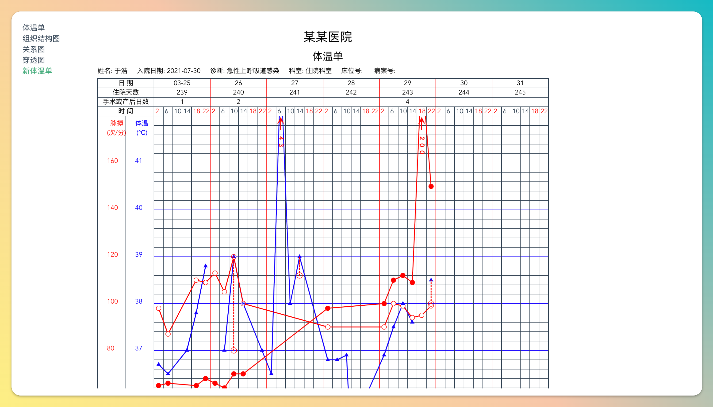
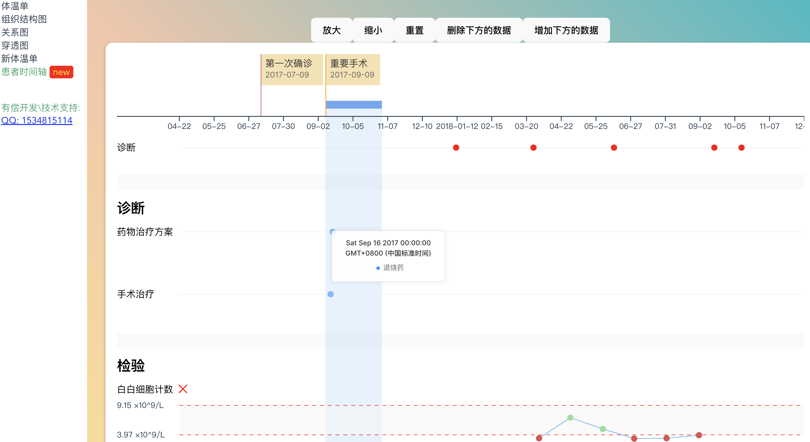

# 说明
项目地址： https://github.com/mydaoyuan/my-development

一些独立组件的项目，目前有体温单、股权穿透图、关系图 https://2guliang.top/temperature/graphicsPuls

患者时间轴 <https://2guliang.top/temperature/timeChat>





## 安装依赖

npm install  

## 启动项目

npm run serve


## 体温单代码说明

项目代码结构如下
```
├── App.vue
├── assets
│   └── logo.png
├── components  主要代码存放区域
│   ├── data.js  静态数据，数据格式按照这个来就可以正常的展示体温了
│   ├── chartView.vue 代码引入demo， 用于引入数据 展示体温单。 也包含了打印的代码
│   ├── printView.vue
│   └── temperature  体温单组件文件夹，如需移植，这直接复制这个文件夹到新项目
│       ├── graphics.vue   体温单源码组件，一般情况不需要修改，直接仿照 chartView.vue 文件引入即可使用
│       └── utils.js  体温单组件用到的一些工具函数
├── main.js
└── router
    └── index.js
```

## 要请作者喝杯可乐吗？🥰

 

## 技术支持

可有偿提供技术支持，定制开发等。
